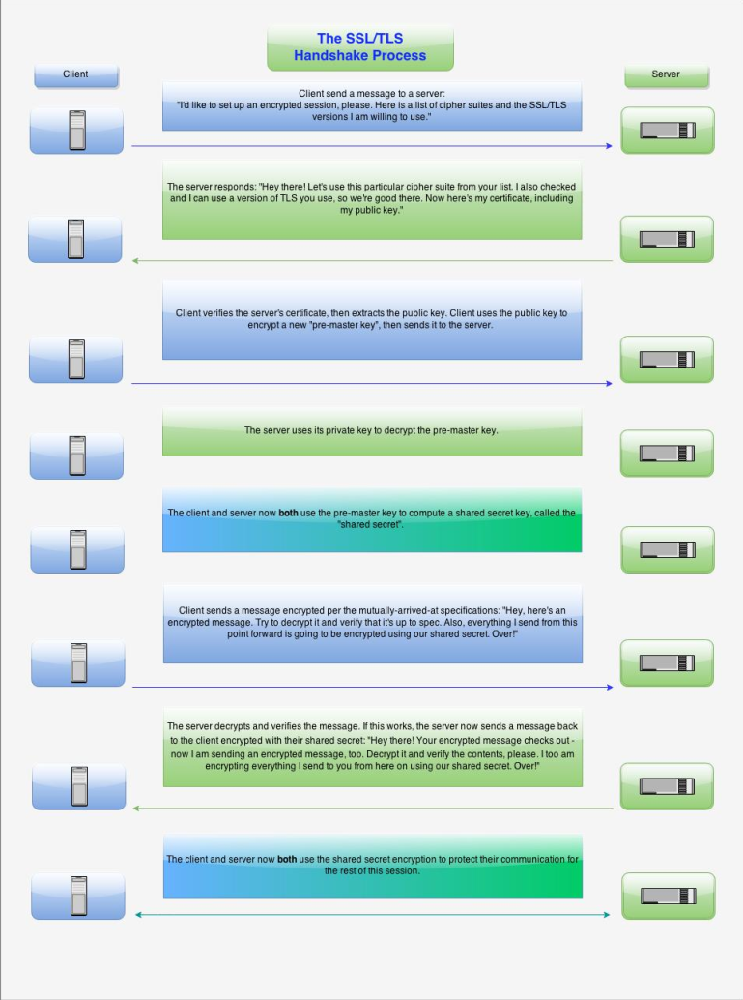
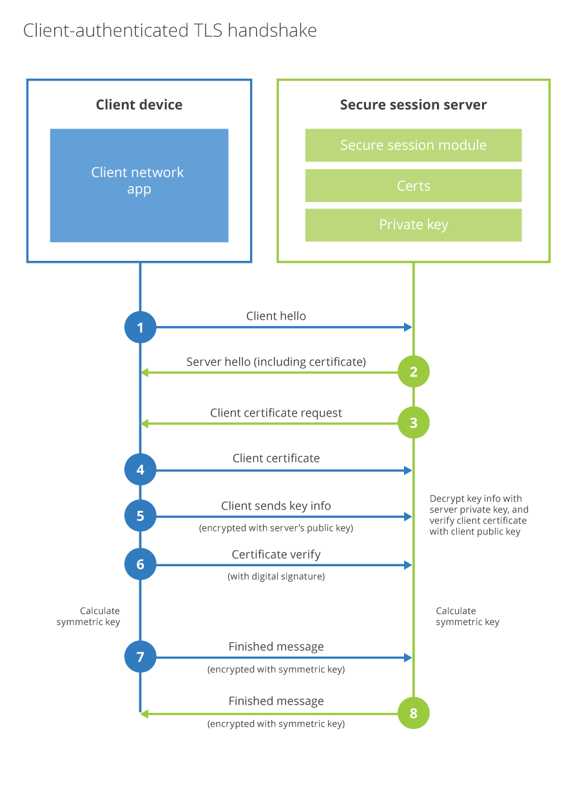
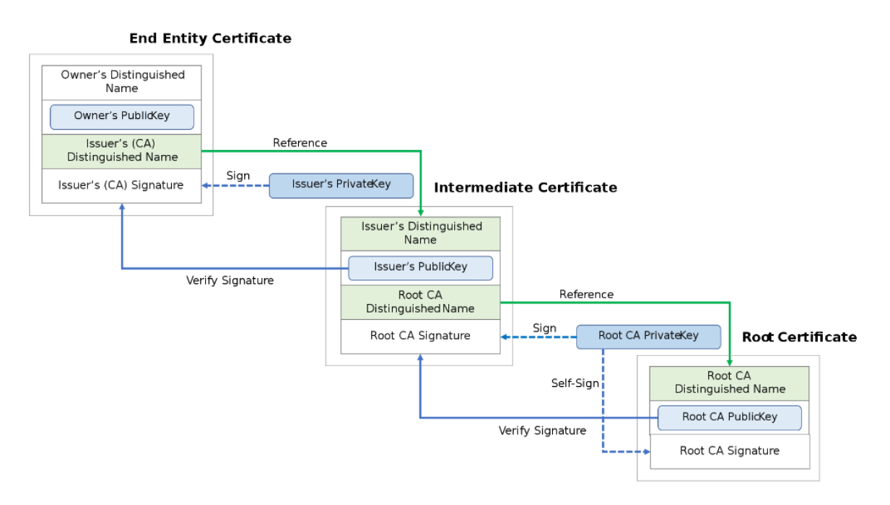

I find it depressing when members of the IT community don't understand how SSL/TLS works so I've taken the time to compile a lot of the information as to how it works here. Note that a lot of this has been ripped directly from Wikipedia or RFC documentation and I am not at all taking credit for the work of the people that made those wonderful documents.

## What is SSL/TLS?

Transport Layer Security (TLS), and its now-deprecated predecessor, Secure Sockets Layer
(SSL), are cryptographic protocols designed to provide communications security over a
computer network. Several versions of the protocols find widespread use in applications such as
web browsing, email, instant messaging, and voice over IP (VoIP). Websites can use TLS to
secure all communications between their servers and web browsers.

The TLS protocol aims primarily to provide privacy and data integrity between two or more
communicating computer applications. When secured by TLS, connections between a client
(e.g., a web browser) and a server (e.g., wikipedia.org) should have one or more of the following
properties:

- The connection is private (or secure) because symmetric cryptography is used to encrypt
the data transmitted. The keys for this symmetric encryption are generated uniquely for
each connection and are based on a shared secret that was negotiated at the start of the
session. The server and client negotiate the details of which encryption algorithm and
cryptographic keys to use before the first byte of data is transmitted. The negotiation of a
shared secret is both secure (the negotiated secret is unavailable to eavesdroppers and
cannot be obtained, even by an attacker who places themselves in the middle of the
connection) and reliable (no attacker can modify the communications during the
negotiation without being detected).

- The identity of the communicating parties can be authenticated using public-key
cryptography. This authentication can be made optional, but is generally required for at
least one of the parties (typically the server).

- The connection is reliable because each message transmitted includes a message integrity
check using a message authentication code to prevent undetected loss or alteration of the
data during transmission.

In addition to the properties above, careful configuration of TLS can provide additional privacy related properties such as forward secrecy, ensuring that any future disclosure of encryption keys
cannot be used to decrypt any TLS communications recorded in the past.


## The Basic TLS Handshake

A typical connection example follows, illustrating a handshake where the server (but not the
client) is authenticated by its certificate:

1. Negotiation phase
    - A client sends a ClientHello message specifying the highest TLS protocol version
    it supports, a random number, a list of suggested cipher suites and suggested
    compression methods. If the client is attempting to perform a resumed handshake,
    it may send a session ID. If the client can use Application-Layer Protocol
    Negotiation, it may include a list of supported application protocols, such as
    HTTP/2.
    - The server responds with a ServerHello message, containing the chosen protocol
    version, a random number, cipher suite and compression method from the choices
    offered by the client. To confirm or allow resumed handshakes the server may
    send a session ID. The chosen protocol version should be the highest that both the
    client and server support. For example, if the client supports TLS version 1.1 and
    the server supports version 1.2, version 1.1 should be selected; version 1.2 should
    not be selected.
    - The server sends its Certificate message (depending on the selected cipher suite,
    this may be omitted by the server).
    - The server sends its ServerKeyExchange message (depending on the selected
    cipher suite, this may be omitted by the server). This message is sent for all DHE
    and DH_anon cipher suites.
    - The server sends a ServerHelloDone message, indicating it is done with
    handshake negotiation.
    - The client responds with a ClientKeyExchange message, which may contain a
    PreMasterSecret, public key, or nothing. (Again, this depends on the selected
    cipher.) This PreMasterSecret is encrypted using the public key of the server
    certificate.
    - The client and server then use the random numbers and PreMasterSecret to
    compute a common secret, called the "master secret". All other key data for this
    connection is derived from this master secret (and the client- and server-generated
    random values), which is passed through a carefully designed pseudorandom
    function.

2. The client now sends a ChangeCipherSpec record, essentially telling the server,
"Everything I tell you from now on will be authenticated (and encrypted if encryption
parameters were present in the server certificate)." The ChangeCipherSpec is itself a
record-level protocol with content type of 20.
    - The client sends an authenticated and encrypted Finished message, containing a
    hash and MAC over the previous handshake messages.
    - The server will attempt to decrypt the client's Finished message and verify the
    hash and MAC. If the decryption or verification fails, the handshake is considered
    to have failed and the connection should be torn down.

3. Finally, the server sends a ChangeCipherSpec, telling the client, "Everything I tell you
from now on will be authenticated (and encrypted, if encryption was negotiated)."
    - The server sends its authenticated and encrypted Finished message.
    - The client performs the same decryption and verification procedure as the server
    did in the previous step.

4. Application phase
    - At this point in the process the "handshake" is complete and the application protocol is enabled, with content type of 23. Application messages exchanged between client and server will also be authenticated and optionally encrypted exactly like in their Finished message. Otherwise, the content type will return 25 and the client will not authenticate.

<center></center>

## The Client-authenticated TLS Handshake
a.k.a Mutual Authentication a.k.a mAuth a.k.a mTLS a.k.a 2 Way SSL/TLS

The following full example shows a client being authenticated (in addition to the server as in the
example above) via TLS using certificates exchanged between both peers.

1. Negotiation Phase
    - A client sends a ClientHello message specifying the highest TLS protocol version
    it supports, a random number, a list of suggested cipher suites and compression
    methods.
    - The server responds with a ServerHello message, containing the chosen protocol version, a random number, cipher suite and compression method from the choices offered by the client. The server may also send a session id as part of the message to perform a resumed handshake.
    - The server sends its Certificate message (depending on the selected cipher suite, this may be omitted by the server).
    - The server sends its ServerKeyExchange message (depending on the selected cipher suite, this may be omitted by the server). This message is sent for all DHE and DH_anon ciphersuites.
    - The server sends a CertificateRequest message, to request a certificate from the client so that the connection can be mutually authenticated.
    - The server sends a ServerHelloDone message, indicating it is done with handshake negotiation.
    - The client responds with a Certificate message, which contains the client's certificate.
    - The client sends a ClientKeyExchange message, which may contain a PreMasterSecret, public key, or nothing. (Again, this depends on the selected cipher.) This PreMasterSecret is encrypted using the public key of the server certificate.
    - The client sends a CertificateVerify message, which is a signature over the previous handshake messages using the client's certificate's private key. This signature can be verified by using the client's certificate's public key. This lets the server know that the client has access to the private key of the certificate and thus owns the certificate.
    - The client and server then use the random numbers and PreMasterSecret to compute a common secret, called the "master secret". All other key data for this connection is derived from this master secret (and the client- and server-generated random values), which is passed through a carefully designed pseudorandom function.

2. The client now sends a ChangeCipherSpec record, essentially telling the server,
"Everything I tell you from now on will be authenticated (and encrypted if encryption
was negotiated). " The ChangeCipherSpec is itself a record-level protocol and has type
20 and not 22.
    - Finally, the client sends an encrypted Finished message, containing a hash and
    MAC over the previous handshake messages.
    - The server will attempt to decrypt the client's Finished message and verify the
    hash and MAC. If the decryption or verification fails, the handshake is considered
    to have failed and the connection should be torn down.

3. Finally, the server sends a ChangeCipherSpec, telling the client, "Everything I tell you
from now on will be authenticated (and encrypted if encryption was negotiated). "
    - The server sends its own encrypted Finished message.
    - The client performs the same decryption and verification procedure as the server did in the previous step.

4. Application phase
    - At this point in the process the "handshake" is complete and the application protocol is enabled, with content type of 23. Application messages exchanged between client and server will also be encrypted exactly like in their Finished message.

<center></center>

## The TLS 1.3 Handshake

The TLS 1.3 handshake process involves only one round-trip as opposed to three in TLS 1.2.
This results in reduced latency.

1. Similar to the TLS 1.2 handshake, the TLS 1.3 handshake commences with the
“Client Hello” message – with one significant change. The client sends the list of supported
cypher suites and guesses which key agreement protocol the server is likely to select. The
client also sends its key share for that particular key agreement protocol.
2. In reply to the “Client Hello” message, the server replies with the key agreement protocol that it has chosen. The “Server Hello” message also comprises of the server’s key share, its certificate as well as the “Server Finished” message. The “Server Finished” message, which was sent in the 6th step in TLS 1.2 handshake, is sent in the second step. Thereby, saving four steps and one round trip along the way.
3. Now, the client checks the server certificate, generates keys as it has the key share of the server, and sends the “Client Finished” message. From here on, the encryption of the data begins.

This way, the TLS 1.3 handshake saves an entire round-trip and hundreds of milliseconds. A
major improvement over the TLS 1.2 handshake.


**0-RTT Resumption: The Good**

Another major milestone that TLS 1.3 is set to accomplish is 0-RTT Resumption. It means that if
the client has connected to the server before, TLS 1.3 permits a zero-round trip handshake. This
is accomplished by storing secret information (typically, Session ID or Session Tickets) of
previous sessions and using them when both parties connect with each other in future.


**0-RTT Resumption: The Bad**

However, there are few concerns when it comes to the security in 0-RTT resumption sessions.
The first being the lack of full forward secrecy. It means that if these session ticket keys are
compromised, an attacker can decrypt the 0-RTT data sent by the client on the first flight. Of
course, this can easily be avoided by rotating session keys regularly. But considering TLS 1.2
doesn’t support full forward secrecy at all, TLS 1.3 is definitely an improvement.

The second security concern when it comes to TLS 1.3 0-RTT is that it doesn’t provide a
guarantee of non-replay between connections. If an attacker somehow manages to get hold of
your 0-RTT encrypted data, it can fool the server into believing that the request came from the
server since it has no way of knowing where the data came from. If an attacker sends this request
multiple times, it’s called ‘replay attack.’ It’s not as easy as it sounds and obviously, there are
certain mechanisms to prevent that.

<center></center>

## Common Filetypes

There are several commonly used filename extensions for X.509 certificates. Unfortunately,
some of these extensions are also used for other data such as private keys.

  - .pem – (Privacy-enhanced Electronic Mail) Base64 encoded DER certificate, enclosed between "-----BEGIN CERTIFICATE-----" and "-----END CERTIFICATE-----"
  - .cer, .crt, .der – usually in binary DER form, but Base64-encoded certificates are common too (see .pem above)
  - .p7b, .p7c – PKCS#7 Signed Data structure without data, just certificate(s) or CRL(s)
  - .p12 – PKCS#12, may contain certificate(s) (public) and private keys (password protected)
  - .pfx – PFX, predecessor of PKCS#12 (usually contains data in PKCS#12 format, e.g., with PFX files generated in IIS)
  - .jks - Java KeyStore is a repository of security certificates – either authorization certificates or public key certificates – plus corresponding private keys, used for instance in SSL encryption. In IBM WebSphere Application Server and Oracle WebLogic Server, a file with extension jks serves as a keystore. The Java Development Kit maintains a CA keystore file named cacerts in folder jre/lib/security. JDKs provide a tool named keytool to manipulate the keystore. keytool has no functionality to extract the private key out of the keystore, but this is possible with third-party tools like jksExportKey, CERTivity, Portecle and KeyStore Explorer.

## Certificate Authorities

In cryptography, a certificate authority or certification authority (CA) is an entity that issues
digital certificates. A digital certificate certifies the ownership of a public key by the named
subject of the certificate. This allows others (relying parties) to rely upon signatures or on
assertions made about the private key that corresponds to the certified public key.

A CA acts as a trusted third party—trusted both by the subject (owner) of the certificate and by the party relying upon the certificate. The format of these certificates is specified by the X.509 or EMV standard. A CA issues digital certificates that contain a public key and the identity of the owner. The matching private key is not made available publicly, but kept secret by the end user who generated the key pair.

The certificate is also a confirmation or validation by the CA that the public key contained in the certificate belongs to the person, organization, server or other entity noted in the certificate. A CA's obligation in such schemes is to verify an applicant's credentials, so that users and relying parties can trust the information in the CA's certificates. CAs use a variety of standards and tests to do so.

In essence, the certificate authority is responsible for saying "yes, this person is who they say they are, and we, the CA, certify that".
If the user trusts the CA and can verify the CA's signature, then they can also assume that
a certain public key does indeed belong to whoever is identified in the certificate.

## Chains of Trust

A chain of trust is designed to allow multiple users to create and use software on the system, which would be more difficult if all the keys were stored directly in hardware.

It starts with hardware that will only boot from software that is digitally signed. The signing authority will only sign boot programs that enforce security, such as only running programs that are themselves signed, or only allowing signed code to have access to certain features of the machine. This process may continue for several layers. This process results in a chain of trust. The final software can be trusted to have certain properties, because if it had been illegally modified its signature would be invalid, and the previous software would not have executed it.

The previous software can be trusted, because it, in turn, would not have been loaded if its signature had been invalid. The trustworthiness of each layer is guaranteed by the one before, back to the trust anchor. It would be possible to have the hardware check the suitability (signature) for every single piece of software. However, this would not produce the flexibility that a "chain" provides.

In a chain, any given link can be replaced with a different version to provide different properties, without having to go all the way back to the trust anchor. This use of multiple layers is an application of a general technique to improve scalability, and is analogous to the use of multiple certificates in a certificate chain.

<center></center>

## Encryption Schemas

Encryption Schemas can be broken down into 2 main categories block ciphers and steam
ciphers

### Block ciphers
A block cipher is a deterministic algorithm operating on fixed-length groups of bits, called
blocks. It uses an unvarying transformation, that is, it uses a symmetric key. They are specified
elementary components in the design of many cryptographic protocols and are widely used to
implement the encryption of large amounts of data, including data exchange protocols.
Even a secure block cipher is suitable only for the encryption of a single block of data at a time,
using a fixed key. A multitude of modes of operation have been designed to allow their repeated
use in a secure way, to achieve the security goals of confidentiality and authenticity. However,
block ciphers may also feature as building blocks in other cryptographic protocols, such as
universal hash functions and pseudo-random number generators.

#### Notable Block Ciphers

**Lucifer / DES**

Lucifer is generally considered to be the first civilian block cipher, developed at IBM in the
1970s based on work done by Horst Feistel. A revised version of the algorithm was adopted as a
U.S. government Federal Information Processing Standard: FIPS PUB 46 Data Encryption
Standard (DES). It was chosen by the U.S. National Bureau of Standards (NBS) after a public
invitation for submissions and some internal changes by NBS (and, potentially, the NSA). DES
was publicly released in 1976 and has been widely used.

DES was designed to, among other things, resist a certain cryptanalytic attack known to the NSA
and rediscovered by IBM, though unknown publicly until rediscovered again and published by
Eli Biham and Adi Shamir in the late 1980s. The technique is called differential cryptanalysis
and remains one of the few general attacks against block ciphers; linear cryptanalysis is another,
but may have been unknown even to the NSA, prior to its publication by Mitsuru Matsui. DES
prompted a large amount of other work and publications in cryptography and cryptanalysis in the
open community and it inspired many new cipher designs.

DES has a block size of 64 bits and a key size of 56 bits. 64-bit blocks became common in block
cipher designs after DES. Key length depended on several factors, including government
regulation. Many observers in the 1970s commented that the 56-bit key length used for DES was
too short. As time went on, its inadequacy became apparent, especially after a special
purpose machine designed to break DES was demonstrated in 1998 by the Electronic
Frontier Foundation. An extension to DES, Triple DES, triple-encrypts each block with
either two independent keys (112-bit key and 80-bit security) or three independent keys(168-bit key and 112-bit security). It was widely adopted as a replacement. As of 2011, the
three-key version is still considered secure, though the National Institute of Standards and
Technology (NIST) standards no longer permit the use of the two-key version in new
applications, due to its 80-bit security level.

As of [https://tools.ietf.org/html/rfc8996](https://tools.ietf.org/html/rfc8996) the Single DES block cipher is deprecated and should not be used. 3DES or Triple DES are still allowed as of this RFC.

**IDEA**

The International Data Encryption Algorithm (IDEA) is a block cipher designed by James
Massey of ETH Zurich and Xuejia Lai; it was first described in 1991, as an intended replacement
for DES.

IDEA operates on 64-bit blocks using a 128-bit key, and consists of a series of eight identical
transformations (a round) and an output transformation (the half-round). The processes for
encryption and decryption are similar. IDEA derives much of its security by interleaving
operations from different groups – modular addition and multiplication, and bitwise exclusive or
(XOR) – which are algebraically "incompatible" in some sense.

The designers analyzed IDEA to measure its strength against differential cryptanalysis and
concluded that it is immune under certain assumptions. No successful linear or algebraic
weaknesses have been reported. As of 2012, the best attack which applies to all keys can
break full 8.5-round IDEA using a narrow-bicliques attack about four times faster than
brute force.

As of [https://tools.ietf.org/html/rfc8996](https://tools.ietf.org/html/rfc8996) the IDEA block cipher is deprecated and should not be
used

**RC5**

RC5 is a block cipher designed by Ronald Rivest in 1994 which, unlike many other ciphers, has
a variable block size (32, 64 or 128 bits), key size (0 to 2040 bits) and number of rounds (0 to
255). The original suggested choice of parameters were a block size of 64 bits, a 128-bit key and
12 rounds.

A key feature of RC5 is the use of data-dependent rotations; one of the goals of RC5 was to
prompt the study and evaluation of such operations as a cryptographic primitive. RC5 also
consists of a number of modular additions and XORs. The general structure of the algorithm is a
Feistel-like network. The encryption and decryption routines can be specified in a few lines of
code. The key schedule, however, is more complex, expanding the key using an essentially one-way function with the binary expansions of both e and the golden ratio as sources of "nothing up
my sleeve numbers". The tantalizing simplicity of the algorithm together with the novelty of the
data-dependent rotations has made RC5 an attractive object of study for cryptanalysts.12-round RC5 (with 64-bit blocks) is susceptible to a differential attack using 244 chosen
plaintexts. 18–20 rounds are suggested as sufficient protection.

**Rijndael / AES**

The Rijndael cipher developed by Belgian cryptographers, Joan Daemen and Vincent Rijmen
was one of the competing designs to replace DES. It won the 5-year public competition to
become the AES, (Advanced Encryption Standard).
Adopted by NIST in 2001, AES has a fixed block size of 128 bits and a key size of 128, 192,
or 256 bits, whereas Rijndael can be specified with block and key sizes in any multiple of 32
bits, with a minimum of 128 bits. The blocksize has a maximum of 256 bits, but the keysize
has no theoretical maximum. AES operates on a 4×4 column-major order matrix of bytes, termed
the state (versions of Rijndael with a larger block size have additional columns in the state).

**Blowfish**

Blowfish is a block cipher, designed in 1993 by Bruce Schneier and included in a large number
of cipher suites and encryption products. Blowfish has a 64-bit block size and a variable key
length from 1 bit up to 448 bits. It is a 16-round Feistel cipher and uses large key-dependent Sboxes. Notable features of the design include the key-dependent S-boxes and a highly complex
key schedule.

It was designed as a general-purpose algorithm, intended as an alternative to the ageing DES and
free of the problems and constraints associated with other algorithms. At the time Blowfish was
released, many other designs were proprietary, encumbered by patents or were
commercial/government secrets. Schneier has stated that, "Blowfish is unpatented, and will
remain so in all countries. The algorithm is hereby placed in the public domain, and can be
freely used by anyone." The same applies to Twofish, a successor algorithm from Schneier.

#### Stream ciphers

A stream cipher is a symmetric key cipher where plaintext digits are combined with a
pseudorandom cipher digit stream (keystream). In a stream cipher, each plaintext digit is
encrypted one at a time with the corresponding digit of the keystream, to give a digit of the
ciphertext stream. Since encryption of each digit is dependent on the current state of the cipher, it is also known as state cipher. In practice, a digit is typically a bit and the combining operation is an exclusive-or (XOR).

The pseudorandom keystream is typically generated serially from a random seed value using
digital shift registers. The seed value serves as the cryptographic key for decrypting the
ciphertext stream. Stream ciphers represent a different approach to symmetric encryption from
block ciphers. Block ciphers operate on large blocks of digits with a fixed, unvarying
transformation. This distinction is not always clear-cut: in some modes of operation, a blockcipher primitive is used in such a way that it acts effectively as a stream cipher.

Stream ciphers typically execute at a higher speed than block ciphers and have lower hardware complexity. However, stream ciphers can be susceptible to serious security problems if used incorrectly (see stream cipher attacks); in particular, the same starting state (seed) must never be used twice.

Stream ciphers are often used for their speed and simplicity of implementation in hardware, and
in applications where plaintext comes in quantities of unknowable length like a secure wireless
connection. If a block cipher (not operating in a stream cipher mode) were to be used in this type
of application, the designer would need to choose either transmission efficiency or
implementation complexity, since block ciphers cannot directly work on blocks shorter than their
block size.

For example, if a 128-bit block cipher received separate 32-bit bursts of plaintext,
three quarters of the data transmitted would be padding. Block ciphers must be used in ciphertext
stealing or residual block termination mode to avoid padding, while stream ciphers eliminate this
issue by naturally operating on the smallest unit that can be transmitted (usually bytes).
Another advantage of stream ciphers in military cryptography is that the cipher stream can be
generated in a separate box that is subject to strict security measures and fed to other devices
such as a radio set, which will perform the xor operation as part of their function. The latter
device can then be designed and used in less stringent environments.

ChaCha is becoming the most widely used stream cipher in software; others include: RC4, A5/1, A5/2, Chameleon, FISH, Helix, ISAAC, MUGI, Panama, Phelix, Pike, Salsa20, SEAL, SOBER, SOBER-128, and WAKE.

## Hashing Functions

There are many cryptographic hash algorithms; this section lists a few algorithms that are
referenced relatively often. A more extensive list can be found on the page containing a
comparison of cryptographic hash functions.

**MD5**

MD5 was designed by Ronald Rivest in 1991 to replace an earlier hash function MD4, and was
specified in 1992 as [https://www.ietf.org/rfc/rfc1321.txt](RFC 1321). Collisions against MD5 can be calculated within seconds
which makes the algorithm unsuitable for most use cases where a cryptographic hash is
required. MD5 produces a digest of 128 bits (16 bytes).

**SHA-1**

SHA-1 was developed as part of the U.S. Government's Capstone project. The original
specification – now commonly called SHA-0 – of the algorithm was published in 1993 under the
title Secure Hash Standard, FIPS PUB 180, by U.S. government standards agency NIST
(National Institute of Standards and Technology). It was withdrawn by the NSA shortly after
publication and was superseded by the revised version, published in 1995 in FIPS PUB 180-1
and commonly designated SHA-1. Collisions against the full SHA-1 algorithm can be produced using the shattered attack and the hash function should be considered broken.
SHA-1 produces a hash digest of 160 bits (20 bytes).

Documents may refer to SHA-1 as just "SHA", even though this may conflict with the other
Standard Hash Algorithms such as SHA-0, SHA-2 and SHA-3.

**RIPEMD-160**

RIPEMD (RACE Integrity Primitives Evaluation Message Digest) is a family of cryptographic
hash functions developed in Leuven, Belgium, by Hans Dobbertin, Antoon Bosselaers and Bart
Preneel at the COSIC research group at the Katholieke Universiteit Leuven, and first published
in 1996. RIPEMD was based upon the design principles used in MD4, and is similar in
performance to the more popular SHA-1. RIPEMD-160 has however not been broken. As
the name implies, RIPEMD-160 produces a hash digest of 160 bits (20 bytes).

**Whirlpool**

Whirlpool is a cryptographic hash function designed by Vincent Rijmen and Paulo S. L. M.
Barreto, who first described it in 2000. Whirlpool is based on a substantially modified version
of the Advanced Encryption Standard (AES). Whirlpool produces a hash digest of 512 bits
(64 bytes).

**SHA-2**

SHA-2 (Secure Hash Algorithm 2) is a set of cryptographic hash functions designed by the
United States National Security Agency (NSA), first published in 2001. They are built using the
Merkle–Damgård structure, from a one-way compression function itself built using the Davies–
Meyer structure from a (classified) specialized block cipher.

SHA-2 basically consists of two hash algorithms: SHA-256 and SHA-512. SHA-224 is a variant
of SHA-256 with different starting values and truncated output. SHA-384 and the lesser known
SHA-512/224 and SHA-512/256 are all variants of SHA-512. SHA-512 is more secure than
SHA-256 and is commonly faster than SHA-256 on 64 bit machines such as AMD64.

The output size in bits is given by the extension to the "SHA" name, so SHA-224 has an
output size of 224 bits (28 bytes), SHA-256 produces 32 bytes, SHA-384 produces 48 bytes
and finally SHA-512 produces 64 bytes.

**SHA-3**

SHA-3 (Secure Hash Algorithm 3) was released by NIST on August 5, 2015. SHA-3 is a subset
of the broader cryptographic primitive family Keccak. The Keccak algorithm is the work of
Guido Bertoni, Joan Daemen, Michael Peeters, and Gilles Van Assche. Keccak is based on a
sponge construction which can also be used to build other cryptographic primitives such as a
stream cipher. SHA-3 provides the same output sizes as SHA-2: 224, 256, 384 and 512 bits. Configurable output sizes can also be obtained using the SHAKE-128 and SHAKE-256
functions. Here the -128 and -256 extensions to the name imply the security strength of the
function rather than the output size in bits.


**BLAKE2**

An improved version of BLAKE called BLAKE2 was announced on December 21, 2012. It was
created by Jean-Philippe Aumasson, Samuel Neves, Zooko Wilcox-O'Hearn, and Christian
Winnerlein with the goal of replacing the widely used but broken MD5 and SHA-1 algorithms.
When run on 64-bit x64 and ARM architectures, BLAKE2b is faster than SHA-3, SHA-2, SHA-
1, and MD5. Although BLAKE and BLAKE2 have not been standardized as SHA-3 has,
BLAKE2 has been used in many protocols including the Argon2 password hash, for the
high efficiency that it offers on modern CPUs. As BLAKE was a candidate for SHA-3,
BLAKE and BLAKE2 both offer the same output sizes as SHA-3 – including a configurable
output size.

**BLAKE3**

BLAKE3, an improved version of BLAKE2, was announced on January 9, 2020. It was created
by Jack O'Connor, Jean-Philippe Aumasson, Samuel Neves, and Zooko Wilcox-O'Hearn.
BLAKE3 is a single algorithm, in contrast to BLAKE and BLAKE2, which are algorithm
families with multiple variants. The BLAKE3 compression function is closely based on that
of BLAKE2s, with the biggest difference being that the number of rounds is reduced from
10 to 7. Internally, BLAKE3 is a Merkle tree, and it supports higher degrees of parallelism
than BLAKE2.

## Forward Secrecy

Forward Secrecy (FS), also known as Perfect Forward Secrecy (PFS), is a feature of specific
key agreement protocols that gives assurances that session keys will not be compromised even if
long-term secrets used in the session key exchange are compromised. For HTTPS the long-term
secret is typically the private signing key of the server. Forward secrecy protects past sessions
against future compromises of keys or passwords. By generating a unique session key for every
session a user initiates, the compromise of a single session key will not affect any data other than
that exchanged in the specific session protected by that particular key. This by itself is not
sufficient for forward secrecy which additionally requires that a long-term secret compromise
does not affect the security of past session keys.

Forward secrecy protects data on the transport layer of a network that uses common SSL/TLS
protocols, including OpenSSL, when its long-term secret keys are compromised, as with the
Heartbleed security bug. If forward secrecy is used, encrypted communications and sessions
recorded in the past cannot be retrieved and decrypted should long-term secret keys or passwords
be compromised in the future, even if the adversary actively interfered, for example via a man-in-the-middle attack. The value of forward secrecy is that it protects past communication. This reduces the motivation for attackers to compromise keys. For instance, if an attacker learns a long-term key, but the compromise is detected and the long-term key is revoked and updated, relatively little information is leaked in a forward secure system.

The value of forward secrecy depends on the assumed capabilities of an adversary. Forward
secrecy has value if an adversary is assumed to be able to obtain secret keys from a device (read
access) but is either detected or unable to modify the way session keys are generated in the
device (full compromise). In some cases an adversary who can read long-term keys from a
device may also be able to modify the functioning of the session key generator, as in the
backdoored Dual Elliptic Curve Deterministic Random Bit Generator. Forward security offers no
protection once such a compromise occurred.

## Common Tools

#### OpenSSL

OpenSSL is a software library for applications that secure communications over computer
networks against eavesdropping or need to identify the party at the other end. It is widely used by
Internet servers, including the majority of HTTPS websites.

OpenSSL contains an open-source implementation of the SSL and TLS protocols. The core library, written in the C programming language, implements basic cryptographic functions and provides various utility functions. Wrappers allowing the use of the OpenSSL library in a variety of computer languages are available.

The OpenSSL Software Foundation (OSF) represents the OpenSSL project in most
legal capacities including contributor license agreements, managing donations, and so on.
OpenSSL Software Services (OSS) also represents the OpenSSL project, for Support Contracts.
OpenSSL is available for most Unix-like operating systems (including Linux, macOS, and
BSD) and Microsoft Windows.

OpenSSL supports a number of different cryptographic algorithms:

**Ciphers**

AES, Blowfish, Camellia, Chacha20, Poly1305, SEED, CAST-128, DES, IDEA, RC2,
RC4, RC5, Triple DES, GOST 28147-89, SM4

**Cryptographic hash functions**

MD5, MD4, MD2, SHA-1, SHA-2, SHA-3, RIPEMD-160, MDC-2, GOST R 34.11-94,
BLAKE2, Whirlpool, SM3

**Public-key cryptography**

RSA, DSA, Diffie–Hellman key exchange, Elliptic curve, X25519, Ed25519, X448,
Ed448, GOST R 34.10-2001, SM2(Perfect forward secrecy is supported using elliptic curve Diffie–Hellman since version 1.0.)

As of December 2012, OpenSSL is one of two open source programs involved in validation
under the FIPS 140-2 computer security standard by the National Institute of Standards and
Technology's (NIST) Cryptographic Module Validation Program (CMVP). (OpenSSL itself is
not validated, but a component called the OpenSSL FIPS Object Module, based on
OpenSSL, was created to provide many of the same capabilities). A certificate was first
awarded in January 2006 but revoked in July 2006 "when questions were raised about the
validated module's interaction with outside software." The certification was reinstated in
February 2007.

**Command examples**

The following are some OpenSSL command examples you can use to help troubleshoot your
certificate implementations

This command will attempt to open an SSL/TLS tunnel from the node that runs it to
nodename.mydomain.com on port 443. In a successful state you should see any SSL/TLS Cert
applied to nodename.mydomain.com:443 to be presented in your terminal. In a failure state you
should see an error displayed.

```
openssl s_client -connect google.com:443
```

View full X.509 data for a certificate
```
openssl s_client -connect google.com:443 2>/dev/null | openssl x509 -text
```

Convert a DER file (.crt .cer .der) to PEM

```
openssl x509 -inform der -in certificate.cer -out certificate.pem
```

Convert a PEM file to DER

```
openssl x509 -in certificate.pem -out certificate.der -outform der
```

Convert a PKCS#12 file ( .pfx .p12 ) containing a private key and certificates to PEM

```
openssl pkcs12 -in keyStore.pfx -out keyStore.pem -nodes
```

Encrypt a sting with the password "Password"

```
echo "Super secret squrrels" | openssl enc -aes-256-cbc -a -e -pass pass:Password -pbkdf2
```

Decrypt a string with the password "Password"

```
echo "U2FsdGVkX1//raN1Fube79JCWsXlRbzrla7W1BRJuicrdMZEOFHiNCL1K9Pfm3XY" | openssl enc -aes-256-cbc -a -d -pass pass:Password -pbkdf2
```

Check an MD5 hash of the public key to ensure that it matches with what is in a CSR or
private key

```
openssl x509 -noout -modulus -in certificate.crt | openssl md5
openssl rsa -noout -modulus -in privateKey.key | openssl md5
openssl req -noout -modulus -in CSR.csr | openssl md5
```

Generate a new private key and Certificate Signing Request

```
openssl req -out CSR.csr -new -newkey rsa:2048 -nodes -keyout privateKey.key
```

Generate a self-signed certificate

```
openssl req -x509 -sha256 -nodes -days 365 -newkey rsa:2048 -keyout privateKey.key -out certificate.crt
```

Generate a certificate signing request (CSR) for an existing private key

```
openssl req -out certificate.csr -key privateKey.key -new
```

Generate a certificate signing request based on an existing certificate

```
openssl x509 -x509toreq -in certificate.crt -out CSR.csr -signkey privateKey.key
```
Remove a passphrase from a private key

```
openssl rsa -in privateKey.pem -out newPrivateKey.pem
```

#### Keytool

The keytool command is a key and certificate management utility. It enables users to administer
their own public/private key pairs and associated certificates for use in self-authentication (where
a user authenticates themselves to other users and services) or data integrity and authentication
services, by using digital signatures.

The keytool command also enables users to cache the public keys (in the form of certificates) of their communicating peers. A certificate is a digitally signed statement from one entity (person, company, and so on), which says that the public key (and some other information) of some other entity has a particular value. When data is digitally signed, the signature can be verified to check the data integrity and authenticity. Integrity means that the data hasn't been modified or tampered with, and authenticity means that the data comes from the individual who claims to have created and signed it.

The keytool command also enables users to administer secret keys and passphrases used in symmetric encryption and decryption (Data Encryption Standard). It can also display other security-related information. The keytool command stores the keys and certificates in a keystore.

**While keytool is invaluable in manipulating JKS Keystores it should be noted that while the JKS
format is easy to implement in a Java program it is both a proprietary format and depreciated by
Oracle. If given the option adopting the X.509 Standard in its place is the best practice.**

**Command examples**

Generate a Java keystore and key pair

```
keytool -genkey -alias mydomain -keyalg RSA -keystore keystore.jks -keysize 2048
```

Generate a certificate signing request (CSR) for an existing Java keystore

```
keytool -certreq -alias mydomain -keystore keystore.jks -file mydomain.csr
```

Import a root or intermediate CA certificate to an existing Java keystore

```
keytool -import -trustcacerts -alias root -file Thawte.crt -keystore keystore.jks
```

Import a signed primary certificate to an existing Java keystore

```
keytool -import -trustcacerts -alias mydomain -file mydomain.crt -keystore keystore.jks
```

Generate a keystore and self-signed certificate

```
keytool -genkey -keyalg RSA -alias selfsigned -keystore keystore.jks -storepass password -validity 360 -keysize 2048
```

Check a stand-alone certificate

```
keytool -printcert -v -file mydomain.crt
```

Check which certificates are in a Java keystore

```
keytool -list -v -keystore keystore.jks
```

Check a particular keystore entry using an alias

```
keytool -list -v -keystore keystore.jks -alias mydomain
```

Delete a certificate from a Java Keytool keystore

```
keytool -delete -alias mydomain -keystore keystore.jks
```

Change a Java keystore password

```
keytool -storepasswd -new new_storepass -keystore keystore.jks
```

Export a certificate from a keystore

```
keytool -export -alias mydomain -file mydomain.crt -keystore keystore.jks
```

List Trusted CA Certs

```
keytool -list -v -keystore $JAVA_HOME/jre/lib/security/cacerts
```

Import New CA into Trusted Certs

```
keytool -import -trustcacerts -file /path/to/ca/ca.pem -alias CA_ALIAS -keystore $JAVA_HOME/jre/lib/
```

## Implementing SSL/TLS on your solution

**A method for adoption**

#### Phase 1

Each application that will be adopting SSL/TLS will need to have 3 local ports defined for it.

1. A port for unencrypted traffic so that other solutions calling it don't break during the
implementation steps
2. A port for encrypted traffic for a Basic SSL/TLS Handshake that does not require Mutual
Authentication
3. A port for encrypted traffic for a Mutual Authentication SSL/TLS Handshake Additionally work needed to be scoped to ensure that the application to be encrypted can be supported and any necessary code changes can start to be developed.

Now its time to request some certificates. In an ideal situation each node in the environment
would have its own personal certificate however once your environments begin to grow you may
find that approach unwieldy as each certificate would have to be managed independently and can
be a nightmare to implement when scaled.

This can be worked around with liberal application of the Subject Alternate Name (SAN) field in the X.509 Standard. By leveraging this an entire stack of nodes can share the same certificate across common nodes without having the drawback of managing a huge amount of certificates.

The Catch-22 of this strategy is that in the event that this certificate either expires or becomes compromised a redeployment of a different certificate with the same properties would have to be implemented to restore system functionality across each node this certificate is signed for. An example of this follows. Use the strategy that works best for your solution.

Given a 3 node stack (example1.mydomain.com(10.0.0.1), example2.mydomain.com(10.0.0.2), example3.mydomain.com(10.0.0.3)) a certificate that would be valid for these nodes would contain the following SAN data

```
DNS: example1.mydomain.com
DNS: example1
IP: 10.0.0.1
DNS: example2.mydomain.com
DNS: example2
IP: 10.0.0.2
DNS: example3.mydomain.com
DNS: example3
IP: 10.0.0.3
```

Note that each DNS record and IP are recorded as separate entity's in the SAN field also
note that there is a distinction between between fully qualified domain names (FQDN) and
short names for each node in the stack and they all need to be explicitly defined
Keystores, Truststores and how to play nice with multiple environments

Keystores are certificate bundles that are encrypted and contain the private key and certificate
chain your application will be using to encrypt its traffic for the purposes of SSL. Being
encrypted they will require a password that your application must pass to it to leverage the key
stored within. These passwords are sensitive and should be treated the same as any other
password do not leave them in unencrypted formats on code repositories or config files.

Truststores are certificate bundles that may or may not be encrypted that contain public keys of
certificate authorities your application can trust this will most likely contain the public keys for
your companies Certificate Authorities as well as the CA's for any third party your application may be connecting to outside of your company.

Generic CA Bundles are certificate bundles for common External Certificate Authorities
(Digicert, Entrust, etc.) like the Truststores but come prepackaged within the installation of
Operating Systems or application frameworks like Java. These are generally safe to trust and
change with updated packages or standard patching processes.

**Note that any modifications you make to Generic CA bundles will not persist as these
packages are upgraded in the future and modifying them while possible is not considered
best practice.**

#### Phase 2

Now that you have your newly modified code, Keystores and Truststores you can now move
forward with implementing your Basic SSL configuration as defined in Phase 1. Once its been
implemented your clients can then begin to adopt the Basic SSL configuration in their
applications. Note that any client reaching out to this stack on the Basic SSL port will need to
trust the certificate authorities that signed the certificate your using. As an example if you signed your certificate using the company CA they would need to trust that CA before they would be able to make a successful connection.

#### Phase 3

Once Basic SSL has been adopted in Phase 2 the Mutual Authentication option can be
implemented. In addition to the steps listed in Phase 2 your client will also need to implement a
certificate on their side that is trusted by your system. In this case the CA they used to sign
would need to be added to your Truststore if it doesn't already exist. Once implemented your
client can then modify their config and adopt SSL/TLS Mutual Authentication.

Note the configuration you implemented in Phase 2 may be different from Phase 3 consult
your technologies manual pages for more information.

#### Phase 4

This phase is optional based on your solution and plans. Once Phase 3 has been adopted
widely and you have moved all of your clients to at least Phase 2 you can begin having
discussions around shutting down your unencrypted port and making plans to implement that.

## How do I install an SSL/TLS Certificate on Technology X?

Unfortunately there is no straight answer to that question. The best advice I can give you is to
review your applications specific manual pages to determine how to implement SSL/TLS on that
platform as each technology is different. You can start by checking out the below links for
various Domain Name Providers that may give you clues as to where to look in your specific
technology. If after reviewing your manuals, documentation and links and no such information
can be found hope is not lost you may still be able to implement SSL/TLS by way of a wrapper
program such as stunnel which I have included the manual page to below.

[https://www.thesslstore.com/knowledgebase/ssl-install/](https://www.thesslstore.com/knowledgebase/ssl-install/)

[https://www.digicert.com/kb/ssl-certificate-installation.htm](https://www.digicert.com/kb/ssl-certificate-installation.htm)

[https://www.godaddy.com/help/install-ssl-certificates-16623](https://www.godaddy.com/help/install-ssl-certificates-16623)

[https://www.namecheap.com/support/knowledgebase/article.aspx/795/69/how-to-install-sslcertificates](https://www.namecheap.com/support/knowledgebase/article.aspx/795/69/how-to-install-sslcertificates)

[https://www.entrust.com/knowledgebase/ssl/how-to-generate-ecc-certificate-signingrequest-using-microsoft-management-console-mmc-on-microsoft-windows-2012](https://www.entrust.com/knowledgebase/ssl/how-to-generate-ecc-certificate-signingrequest-using-microsoft-management-console-mmc-on-microsoft-windows-2012)

[https://linux.die.net/man/8/stunnel](https://linux.die.net/man/8/stunnel)

## More Info

Transport Layer Security - [https://en.wikipedia.org/wiki/Transport_Layer_Security](https://en.wikipedia.org/wiki/Transport_Layer_Security)

SSL 3.0 RFC - [https://tools.ietf.org/html/rfc6101](https://tools.ietf.org/html/rfc6101)

TLS 1.0 RFC - [https://tools.ietf.org/html/rfc2246](https://tools.ietf.org/html/rfc2246)

TLS 1.1 RFC - [https://tools.ietf.org/html/rfc4346](https://tools.ietf.org/html/rfc4346)

TLS 1.2 RFC - [https://tools.ietf.org/html/rfc5246](https://tools.ietf.org/html/rfc5246)

TLS 1.3 RFC - [https://tools.ietf.org/html/rfc8446](https://tools.ietf.org/html/rfc8446)

TLS 1.0 & 1.1 Deprication RFC - [https://tools.ietf.org/html/rfc8996](https://tools.ietf.org/html/rfc8996)

X.509 Format - [https://en.wikipedia.org/wiki/X.509](https://en.wikipedia.org/wiki/X.509)

Java Keystore - [https://en.wikipedia.org/wiki/Java_KeyStore](https://en.wikipedia.org/wiki/Java_KeyStore)

Java Keystore Java Doc - [https://docs.oracle.com/javase/8/docs/api/java/security/KeyStore.html](https://docs.oracle.com/javase/8/docs/api/java/security/KeyStore.html)

Certificate Authority - [https://en.wikipedia.org/wiki/Certificate_authority](https://en.wikipedia.org/wiki/Certificate_authority)

Chains of Trust - [https://en.wikipedia.org/wiki/Chain_of_trust](https://en.wikipedia.org/wiki/Chain_of_trust)

Block Ciphers - [https://en.wikipedia.org/wiki/Block_cipherStream](https://en.wikipedia.org/wiki/Block_cipherStream)

Ciphers - [https://en.wikipedia.org/wiki/Stream_cipher](https://en.wikipedia.org/wiki/Stream_cipher)

Hash Functions - [https://en.wikipedia.org/wiki/Cryptographic_hash_function](https://en.wikipedia.org/wiki/Cryptographic_hash_function)

Forward Secrecy - [https://en.wikipedia.org/wiki/Forward_secrecy](https://en.wikipedia.org/wiki/Forward_secrecy)

OpenSSL - [https://en.wikipedia.org/wiki/OpenSSL](https://en.wikipedia.org/wiki/OpenSSL)

OpenSSL Man Page - [https://linux.die.net/man/1/openssl](https://linux.die.net/man/1/openssl)

Keytool - [https://docs.oracle.com/javase/8/docs/technotes/tools/unix/keytool.html](https://docs.oracle.com/javase/8/docs/technotes/tools/unix/keytool.html)

Keytool Man Page - [https://docs.oracle.com/en/java/javase/13/docs/specs/man/keytool.html](https://docs.oracle.com/en/java/javase/13/docs/specs/man/keytool.html)
