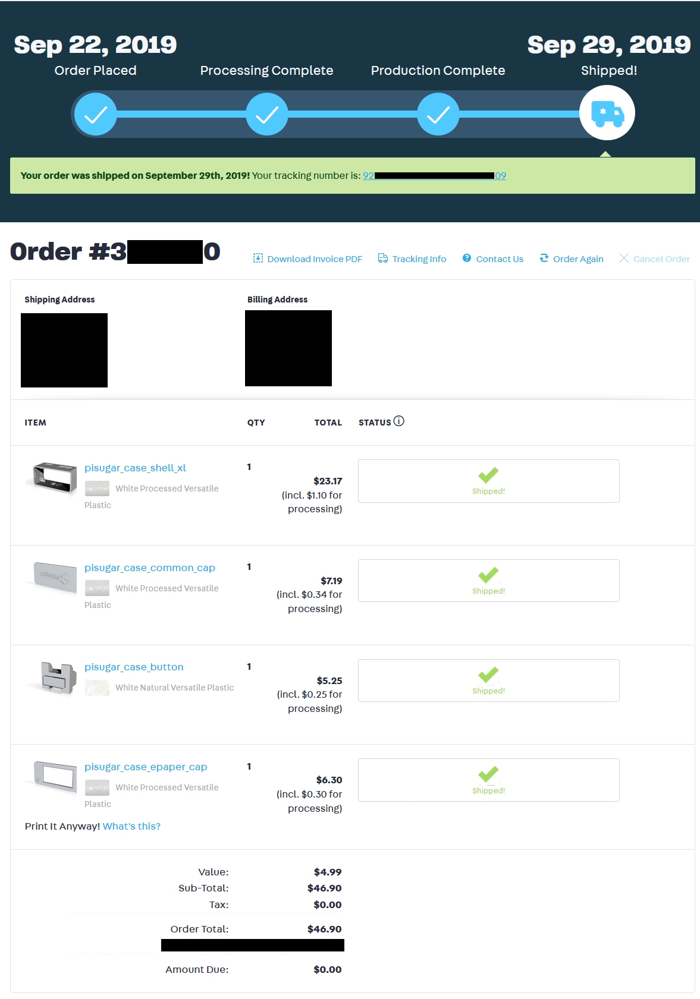
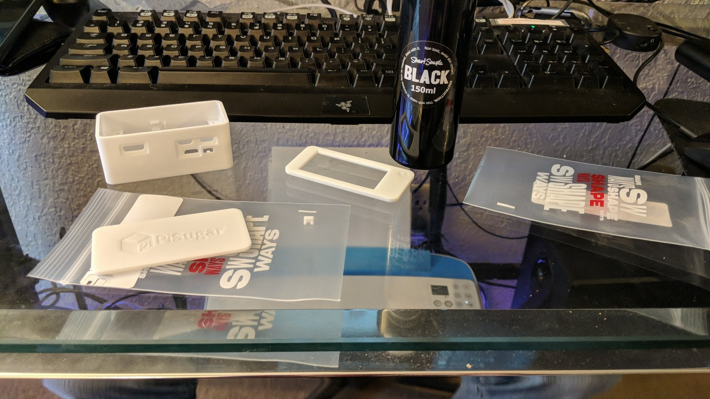
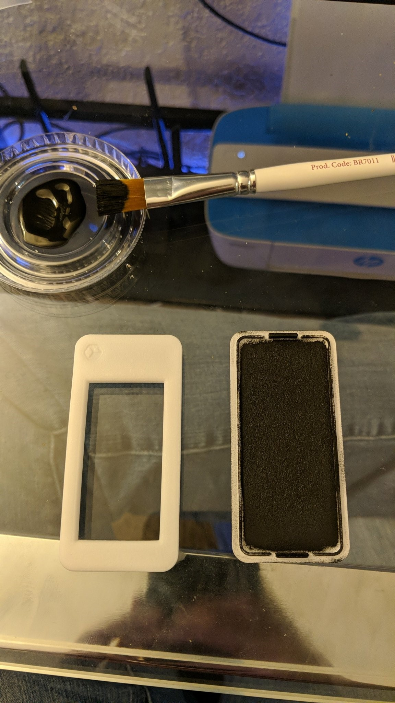
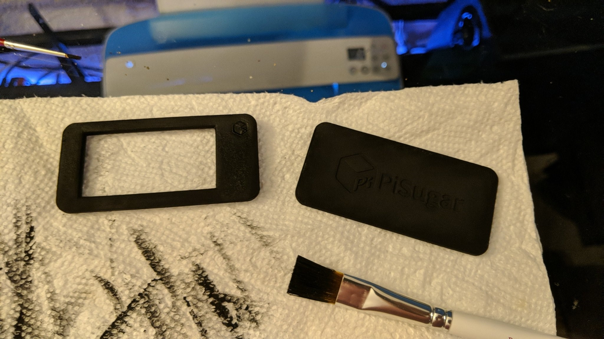
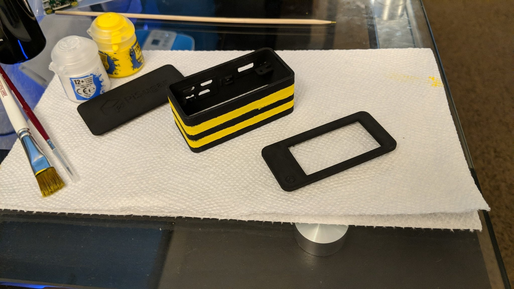
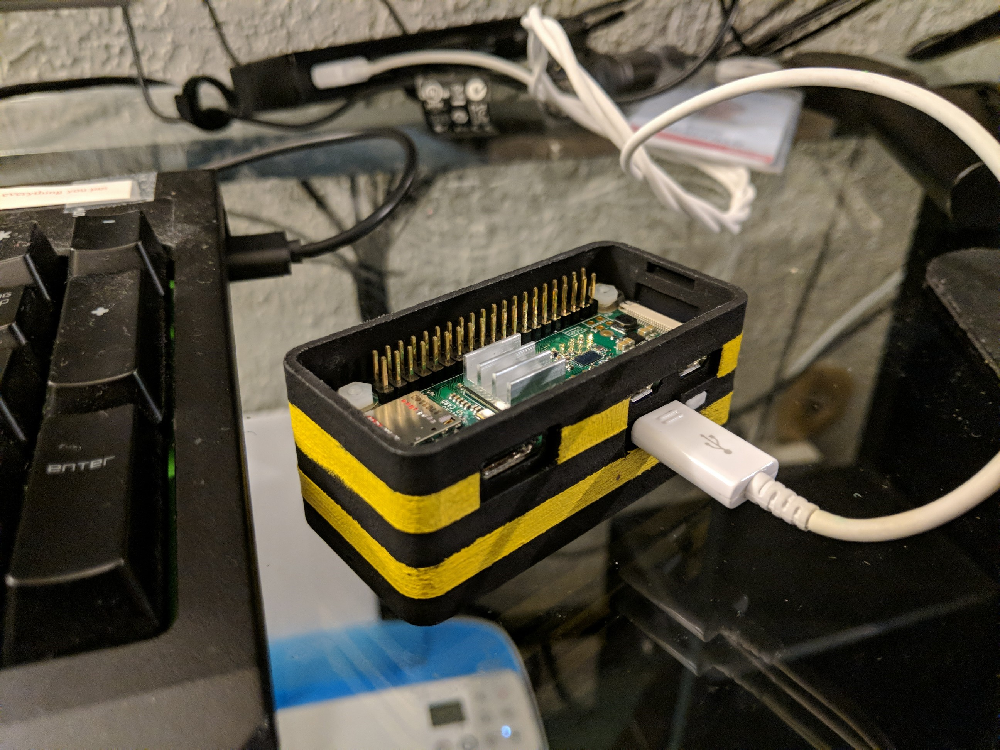
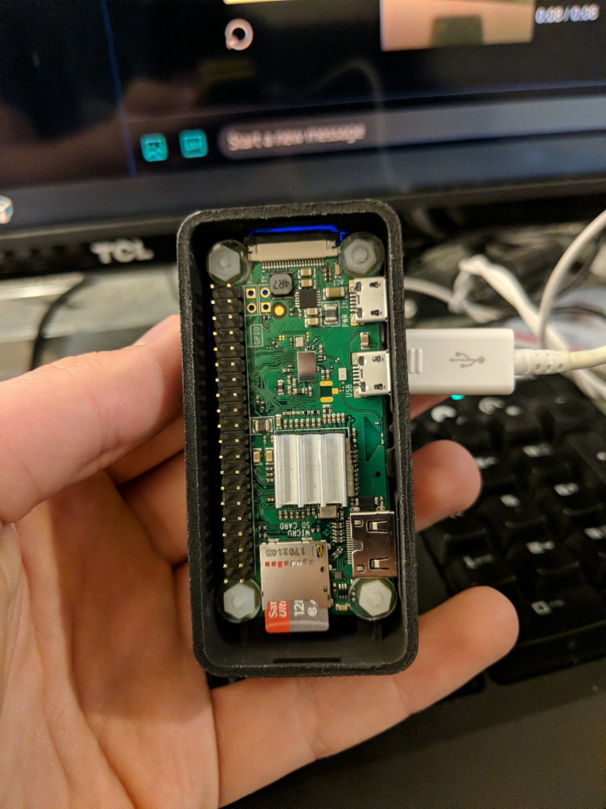
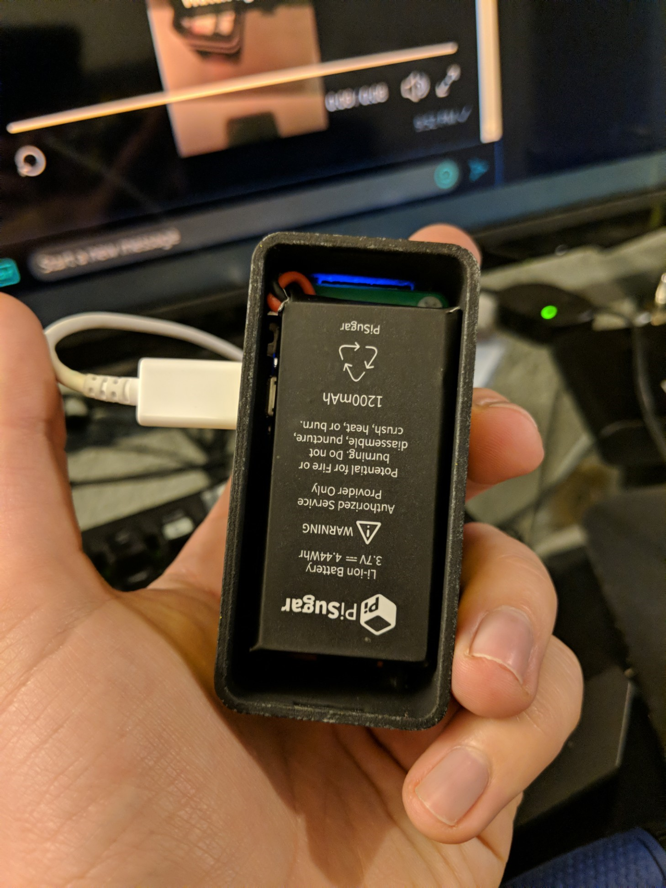
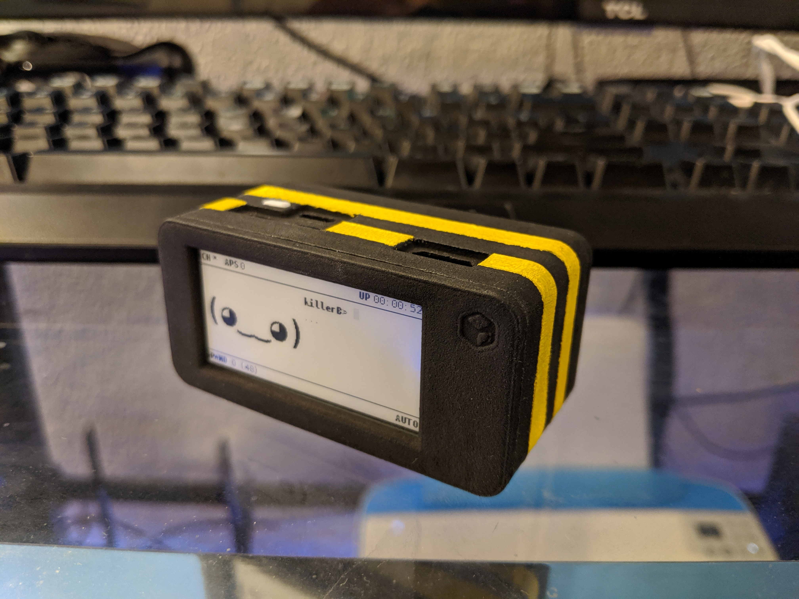

In this industry I see a lot a great projects. Code stacked in great monoliths towering over us all. But at the end of the day that all it is line after line of words in a document. Its a real shame that so many great projects don't get the props they deserve because they look just like the rest. So today I figured I would go over how I breathed new life into my pwnagotchi killerB.

Step 1: Deciding on a case and ordering parts
-----------------------
The case you pick will ultimately decide what kind of environment your pwnagotchi will be used in and how much hassle you are willing to deal with. Take some time to consider the case that you pick and what your needs are for the project. For me I had several criteria that I knew I had to meet me selecting mine.

* Weight
  * No more than a pound and a half grand total
* Housing
  * Something that I could easily decorate
  * Does not conduct electricity
  * Slip resistant
  * Supports a 2.13in eInk Display
* Optional Features
  * Battery that will get me more than 1 hour of run time by itself

While I was in this step I began ordering some of the base components I would need for the project.

* An SD Card
  * I like to have some space on my project to mess around so I went with a 128GB Sandisk but consult the project docs if you would like to go lower than 16GB
* A Raspberry Pi
  * I went with the Zero W v1.1 on this build but I hear that the pwnagotchi will support 5Ghz on the Pi 4 model
* A Battery pack
  * Ended up going with a [PiSugar (1200 mAh Variant)](https://www.amazon.com/gp/product/B07RC649ZC)
* A Screen
  * For me the [Waveshare 2.13in eInk display](https://www.amazon.com/gp/product/B071S8HT76) was the only one working when I sourced these parts again check the documentation on screens that are supported

Ultimately I ended up going with the [PiSugar XL Case for the Raspberry Pi Zero W](https://github.com/PiSugar/PiSugar). In my eyes this case met all of the things that I wanted in this project of course this led me to my next big problem ...

Step 2: Sourcing the materials
-----------------------

So to my everlasting shame I don't own a 3D Printer nor do I have easy access to one. 3D modeling is a gap in my knowledge that I hope to address one day but I will be saving that for another project. Luckily for me there are plenty of very reputable business that will print just about anything you send them so long as they can read the files and it doesn't go against their terms of service. In my case I decided to go with Shapeways. For those who don't know who they are
```
Shapeways is a Dutch-founded, New York-based 3D printing marketplace and service, startup company. Users design and upload 3D printable files, and Shapeways prints the objects for them or others. Users can have objects printed in over 55 materials and finishes, these include: plastics, precious metals, steel and food-safe ceramics, which were discontinued and have been replaced by porcelain materials. As of 2019, Shapeways printed and sold more than ten million user-created objects.

- https://en.wikipedia.org/wiki/Shapeways
```
however there are many other companies that one could go with. Just google around for 3d printing services and I'm sure you will find one that fits your needs.

If you choose to go the same route that I did then its as simple as logging in, uploading the STL files that you got from the Pi Sugar link from above and checking out. They will go ahead and inspect the models to let you know if there may be any issues with manufacturing and print the parts in your selected material. Once that's done they go ahead and ship you the parts.



In my case the total ending up coming to $46.90 USD but deviating from the materials that I selected may change the cost.

Step 3: Decorating
-----------------------

Once all of the parts and peace's have been delivered its time to get to decorating! Remember that your pwnagotchi is as individual as you are and just like how I would assume you don't like looking bad neither does your pwnagotchi! For this build I will be using a base color of [BLACK 2.0 from Culture Hustle](https://www.culturehustleusa.com/products/black-v1-0-beta-the-world-s-mattest-flattest-blackest-art-material) as it is acrylic paint that works well on plastics and as an added bonus has some [very interesting light absorbing properties](https://cdn.shopify.com/s/files/1/0077/6503/3018/products/Visible_blacks_only_1024x1024@2x.jpg?v=1556123632) that I hope to use in future projects. I will also be using some [Citadel layer paint in Phalanx Yellow](https://www.amazon.com/Citadel-Paint-Layer-Phalanx-Yellow/dp/B07STRP4BF) for the detail work. This paint was chosen simply for aesthetic reasons and because its commonly used on Warhammer 40k figures which makes it very compatible with commonly used plastics.



Once I had all of the things I needed it was time to get decorating! As you can see by this picture the Black paint is very thick; I was able to accomplish what you see here in one coat. This picture was taken while I was testing the compatibility of this paint with the plastic; upon finding no problems with it I knew it was safe to proceed with the rest of the parts.





Once all the parts were painted they were set aside for 24 hours to cure completely. I've seen a couple of videos from the artist claiming that this paint actually gets darker the longer it cures up to 24 hours so I wanted to make sure I got the most out of the dark color.


Once the first round of drying was done it is time to add the details! To get these stripes I just used some masking tape to mark of an area and begin to generously add the Phalanx Yellow taking care to let it dry before adding a second coat and removing the masking tape. This process was repeated twice, once for each stripe.



Step 4: Bringing it all together
-----------------------

Once everything is good and dry you should be at the point where its all ready to come together. You can begin by first putting the button into place and then adding the PiSugar board to the bottom of the case. Following that insert the plastic screws that come with it. I found that using the battery attached to the board and sliding it over so that it holds 2 of the screw's in place while you hold the other two with your fingers is a good way to keep them all in place while you insert the Pi with flashed SD card into the other side. Once that's done add the plastic spacers that come with and the plastic nuts and your good to go.

Please note that at this point its a good time to do a quick test of the board to make sure that everything is functioning as expected. Click the button once to turn on the PiSugar and twice to turn it off. The 4 lights on that board will glow indicating a full charge and you should see that through the 4 holes in the side of the case any less than 4 lights indicates a discharged battery of 25%, 50%, 75% and 100% respectively. Additionally you should also see the raspberry pi indicator light flashing indicating a boot up and then it will blink 10 times *... I think* after the pwnagotchi software and config have been loaded.

__An important note about changing, under no circumstances should you charge the PiSugar and run power to the Pi at the same time. The manufacturer has noted this has potential to short out the boards in the best case and may cause a fire in the worst case due to overcharging.__

__If you run power to the PiSugar like seen in the photo it will keep the Pi on while it changes, this is normal behavior. Additionally I have seen no problems so far with running a data only line to a computer to tinker on the data port while I am float charging the battery on the PiSugar but I accept no responsibility in the event something happens to either you or your property. Tinker and charge at your own risk.__



If you get to this point your pwnagotchi should look something like this.





__Please don't be and idiot like me and forget to remove any heatsinks on the Pi before adding the eInk Display. Any heatsinks present will most assuredly destroy the back of your eInk and you will have to order a new one if you fuck it up. There is not enough room in this case for both.__

Once you have heeded the warning above you can line up your eInk Display and add it to the header pins. This done you can snap on the back and front panels and take your brand new and beautiful pwnagotchi for a walk!


